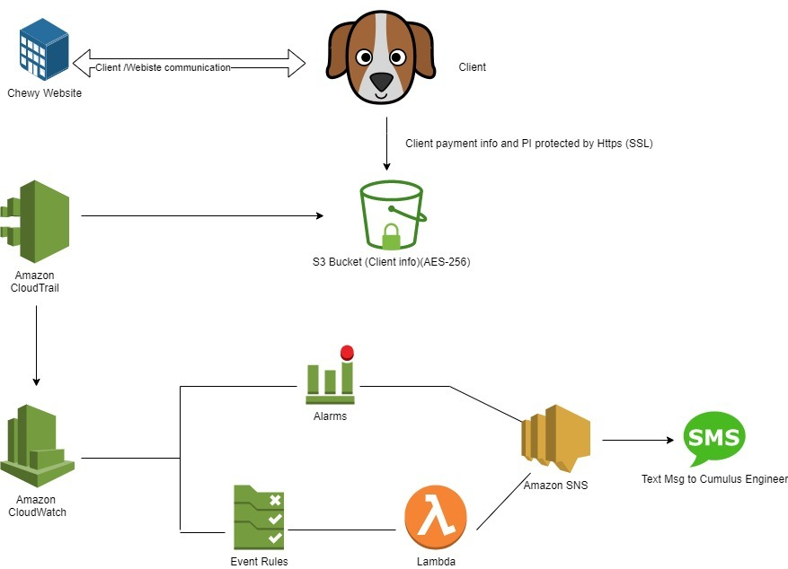

# ChewySecurity

Team members: Ben Arno, Alex Wise, Kevin Isaac, Jose Cardozo

Over the course of this project we will stand up an Amazon Web Service Virtual Private Computer to store and encrypt customer PII and PCI at rest and in-transit on a Linux server.  Utilize SEIM/log integration and incorporate cloud monitoring to demonstrate AWS' ability to detect and alert admins via SMS of unauthorized attempts to access data.  Execute a Data Loss Prevention solution to detect and prevent exfiltration of PII/PCI data from an instance.

Relevant Documents:
- [Security Architecture Narrative](https://docs.google.com/document/d/11IdnT72GXUPuHNFf1UIKD-jjPUzKMz_olkmGPfGQDi4/edit)
- [Data Security Policy](https://docs.google.com/document/d/1TmUvwSz-kb68LhJAJ1zpAmh4gj9jNiScmxPQ9Zpx2bo/edit)
- [Risk Assessment](https://onedrive.live.com/edit.aspx?resid=E961945CD39F541D!294&ithint=file%2cxlsx&authkey=!ACVnXdgj0at4z9U)
- [Security Assessment Report](CumulusSecSAR.pdf)
- [Cloud Security Policy](https://docs.google.com/document/d/16GAqKKi2LsY-ohSRKr049tkfJKsHHafZZA1qXBAw16s/edit?usp=sharing)

